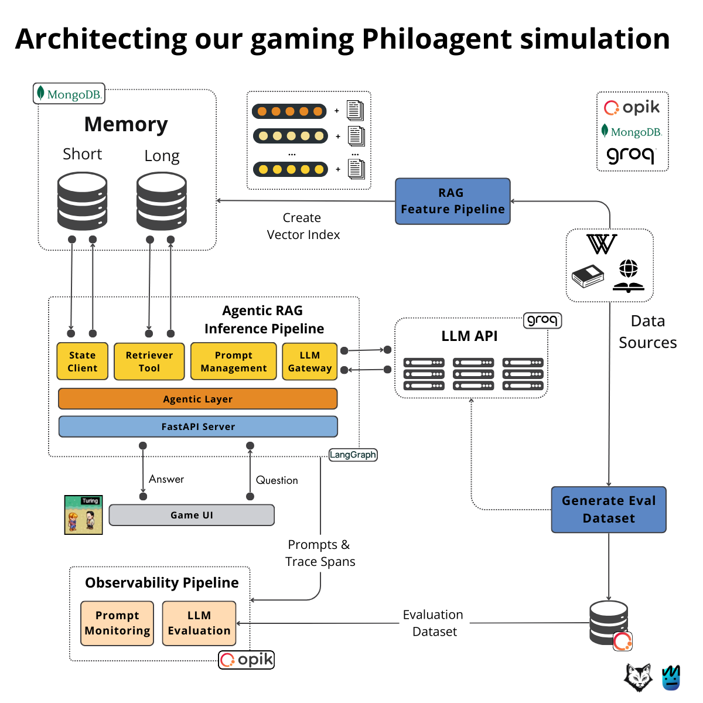

<div align="center">
  <h1>💊 Pharma Agent</h1>
  <h3>An AI-powered 2D game simulation and RAG agent for Johnson & Johnson corporate information.</h3>
  <p class="tagline">Interactive conversational AI powered by <b>LangGraph</b>, <b>MongoDB</b>, <b>Groq</b>, and <b>Phaser 3</b>.</p>
</div>

</br>

<p align="center">
    
</p>

## 📖 About This Project

Welcome to **Pharma Agent**! This repository hosts an interactive 2D simulation game and an AI agent backend designed to provide information about Johnson & Johnson's corporate operations, division details (Innovative Medicine and MedTech), and "Our Credo" values.

Instead of browsing static text files, users can explore a visual 2D town environment and converse directly with a J&J corporate agent. The agent is backed by a Retrieval-Augmented Generation (RAG) system containing crawled website content, enabling accurate and context-aware responses.

### 🎮 Features

- **Interactive 2D Town UI**: A Phaser 3-powered game interface where you can control a character to walk around and interact with the corporate agent.
- **RAG-Powered Conversations**: The agent utilizes local vector embeddings and J&J website knowledge to answer questions accurately.
- **Short & Long-Term Memory**: Implemented using MongoDB, ensuring that the agent maintains memory of previous user interactions and preferences.
- **Real-Time Communication**: Seamless real-time dialogue streaming via WebSockets.
- **LLMOps & Observability**: Integrated with Opik to monitor trace history, evaluate performance, and version prompts.

---

## 🎯 What You'll Learn & Explore

This project demonstrates production-grade AI engineering practices:

- **Agent Orchestration**: Building structured, stateful agents using `LangGraph` and `LangChain`.
- **Vector Search & RAG**: Creating database queries and retrieving relevant chunks from MongoDB.
- **Real-Time APIs**: Deploying high-throughput, low-latency APIs with `FastAPI` and `WebSockets`.
- **Local Infrastructure Management**: Spinning up a complete stack (Frontend, Backend, Database) using `Docker` and `Docker Compose`.
- **System Evaluation**: Automatically scoring agent outputs using LLM-as-a-judge patterns and tracking them via `Opik`.

---

## 🏗️ Project Structure

The codebase is split into two main packages:

```bash
.
├── philoagents-api/     # Backend API and RAG pipeline (Python)
└── philoagents-ui/      # Phaser 3-based 2D game interface (Node.js)
```

- **[philoagents-api](file:///d:/philoagents_live/philoagents-api)**: Built using Python 3.11, FastAPI, LangGraph, and MongoDB. Handles text ingestion, vector indexing, query routing, memory storage, and agent execution.
- **[philoagents-ui](file:///d:/philoagents_live/philoagents-ui)**: Built with Phaser 3, Webpack, and TailwindCSS. Runs on Node.js and provides a 2D RPG interface.

---

## 👔 Dataset & Knowledge Base

The agent's knowledge is sourced directly from the Johnson & Johnson corporate website.
The core data is ingested from [philoagents-api/data/jnj_content.txt](file:///d:/philoagents_live/philoagents-api/data/jnj_content.txt), which includes:
- J&J Our Credo values
- Innovative Medicine division information
- MedTech division overview
- Key corporate milestones and updates

Upon running the ingestion script, this content is segmented into chunks, embedded, and indexed inside MongoDB for semantic similarity search.

---

## 🚀 Getting Started

To get the application up and running on your machine, check out the detailed guide in:

👉 **[INSTALL_AND_USAGE.md](file:///d:/philoagents_live/INSTALL_AND_USAGE.md)**

---

## 🔧 Developer Commands

Below is a quick reference for common tasks. Commands are run from the project root using `make`.

### Run Infrastructure
```bash
# Start all services (UI, API, MongoDB, Evidently)
make infrastructure-up

# Stop all services
make infrastructure-stop
```

### Knowledge Base Ingestion
```bash
# Ingest J&J data into MongoDB
make create-long-term-memory

# Reset database collections
make delete-long-term-memory
```

### Test API Directly
```bash
# Send a console prompt to the agent
make call-agent
```

### Run Evaluation (Opik)
```bash
# Evaluate the agent on the evaluation dataset
make evaluate-agent
```

---

## 📄 License

This project is licensed under the MIT License - see the [LICENSE](file:///d:/philoagents_live/LICENSE) file for details.
